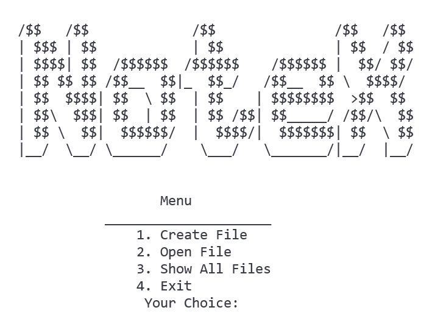

 # NoteX: A Text Editor Built on Linked List Ingenuity

Welcome to NoteX, a console-based text editor that embraces the power of data structures!

 ## Key Features: 

-  Crafted with 2D Linked Lists:  Experience efficient text manipulation through the innovative use of linked lists.
-  Seamless Text Editing:  Create, edit, and navigate text with ease.
-  Optimized for Performance:  Linked lists ensure smooth operations for a distraction-free editing experience.

 ## Preview: 

 ## Usage Instructions: 

1.  Compilation: 
   - Compile the C++ code using a suitable compiler (e.g., g++).
2.  Launch NoteX: 
   - Run the compiled executable file.

 ## Navigation and Editing: 

| Key | Function |
|---|---|
| Arrow keys | Navigate within text |
| Enter | Insert a new line |
| Backspace | Delete the character to the left |
| Delete | Delete the character under the cursor |
| Escape | Save the current file & exit|

 ## Additional Features (if applicable): 
-  Undo and Redo: 

 ## Acknowledgments: 

-  Special thanks to Muhammad Faraz for their guidance and support. 

 ## Contributing: 

- Feel free to fork the repository and submit pull requests for any enhancements or bug fixes.

 Explore the code and unleash your creativity with NoteX! 

 GitHub Repo:  [https://github.com/SalmanNawaz921/Notepad/]
